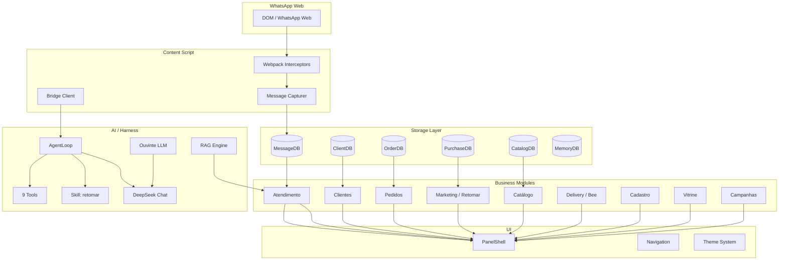

<div align="center">

# Mettri

### Plataforma de vendas conversacionais para WhatsApp Web

[](https://www.typescriptlang.org/)
[](LICENSE)
[](package.json)
[]()
[]()
[]()

> Construído por IA · Guiado por ZenSpecs · Orquestrado pelo [**Karma**](https://github.com/ferrarijonas/Karma)

</div>

---

## O que é

O Mettri é uma extensão Chrome que transforma o WhatsApp Web em um **sistema de vendas com memória**. Ele mora na terceira coluna do WhatsApp e oferece:

- **Histórico completo** de conversas (IndexedDB, nunca apaga)
- **Sugestões com IA** para retomar clientes inativos
- **Catálogo e pedidos** integrados
- **Entrega via Bee Delivery** com cotação em tempo real
- **14 módulos** independentes, cada um com UI própria

**Princípio central:** IA sugere, humano aprova. Nenhuma mensagem sai sem confirmação.

---

## Quick Start

```bash
git clone https://github.com/ferrarijonas/Mettri.git
cd Mettri
npm install
npm run build
```

1. Abra `chrome://extensions` → **Modo desenvolvedor**
2. **Carregar sem compactação** → selecione a pasta `dist/`
3. Abra o WhatsApp Web — o Mettri aparece na terceira coluna

---

## Arquitetura



### Módulos

| Módulo | Status | O que faz |
|---|---|---|
| `atendimento` | ✅ Vivo | Painel de conversas em tempo real + sugestões |
| `clientes` | ✅ Vivo | Diretório, histórico, importação XLSX, tags |
| `marketing/retomar` | ✅ Vivo | Reativação de clientes inativos com IA e A/B testing |
| `catalogo` | ✅ Vivo | Produtos, preços, disponibilidade |
| `pedidos` | ✅ Vivo | Registro e acompanhamento de pedidos |
| `delivery` | ✅ Vivo | Cotação e solicitação de frete via Bee Delivery |
| `cadastro` | ✅ Vivo | Ficha do cliente, mapeamento de compras |
| `vitrine` | ✅ Vivo | Recomendações do dia |
| `campanhas` | ✅ Vivo | Campanhas promocionais |
| `harness` | ✅ Vivo | AgentLoop, tools, skills, memory system |
| `ouvir` | ✅ Vivo | Pipeline LLM (DeepSeek), prompt mounting |
| `rag` | ✅ Vivo | Embeddings, índice vetorial, busca semântica |
| `oportunidades` | ✅ Vivo | Ranking de oportunidades de venda |

### AgentLoop Tools

| Tool | Ação |
|---|---|
| `consultar_catalogo` | Buscar produtos e preços |
| `consultar_perfil` | Ver perfil do cliente |
| `consultar_historico` | Ver histórico de conversas |
| `consultar_saldo_bee` | Ver saldo na Bee Delivery |
| `registrar_pedido` | Criar pedido |
| `enviar_mensagem` | Enviar mensagem (com confirmação) |
| `cotar_frete` | Cotar frete na Bee Delivery |
| `solicitar_entrega_bee` | Solicitar entrega |
| `carregar_skill` | Carregar skill procedural sob demanda |

---

## Stack

| Camada | Tecnologia |
|---|---|
| **Linguagem** | TypeScript (strict mode) |
| **Runtime** | Chrome Extension Manifest V3 |
| **Build** | esbuild |
| **Testes** | Vitest (unit) + Playwright (e2e) |
| **Validação** | Zod em toda fronteira |
| **Storage** | IndexedDB (8 databases) |
| **IA** | DeepSeek Chat (function calling) |
| **Lint** | ESLint + Prettier |
| **CI/CD** | GitHub Actions (gh-pages deploy) |

---

## Scripts

| Comando | Descrição |
|---|---|
| `npm run build` | Build de produção |
| `npm run dev` | Build com watch |
| `npm run lint` | ESLint |
| `npm run type-check` | TypeScript (`tsc --noEmit`) |
| `npm run test:unit` | Testes unitários com coverage |
| `npm run test:e2e` | Testes E2E com Playwright |
| `npm run gate` | Pipeline completo: check-mocks → check-cleanup → lint → type-check → build → test:coverage |
| `npm run check-cleanup` | Scan de dados pessoais, tokens e branches órfãos |
| `npm run chrome:debug` | Abre Chrome com porta CDP 9222 |

---

## Como este projeto é construído

O Mettri é desenvolvido por agentes de IA orquestrados pelo [**Karma**](https://github.com/ferrarijonas/Karma) — um harness que vive em `.karma/`:

```
ZenSpec → SPEC.md → @construir → @avaliar → @aprender
  │          │           │            │           │
  │          │      implementa    verifica    consolida
  │          │      gate-runner   adversarial  trail→memory
  │          │
  │     contrato formal com escopo, sabotagens e critério de pronto
  │
 especificação determinística do comportamento esperado
```

Cada funcionalidade nasce como um **ZenSpec** (`ZenSpecKit/`), vira uma tarefa com **SPEC.md** (`.karma/.mettri/tarefas/`), é implementada com **gate-runner** (check-mocks → check-cleanup → lint → type-check → build → test --coverage), verificada por um olhar adversarial, e consolidada em memória cross-sessão.

---

## Filosofia

- **Human-in-the-loop** — IA nunca age sozinha
- **Histórico imutável** — base para IA e reativação
- **Spec-first** — código cumpre contrato (ZenSpec)
- **TypeScript strict + Zod** — sem `any` nas bordas
- **Jidoka** — se quebra, para e corrige

---

## Licença

MIT · [LICENSE](LICENSE)

<p align="center">
  <em>
    Construído com TypeScript estrito, ZenSpecs e Karma.<br>
    <a href=".karma/">Orquestração</a> ·
    <a href="ZenSpecKit/">Especificações</a> ·
    <a href="docs/">Documentação</a>
  </em>
</p>
