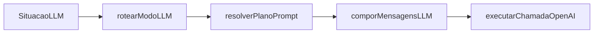

# Infraestrutura LLM (`infrastructure-llm`)

Esta feature existe para definir **um único pipeline transversal** de chamadas ao modelo: da **situação de produto** até o **texto gerado**, passando por **modo**, **plano de prompt** e **composição** — sem duplicar regras em cada módulo (Retomar, RAG, pipeline comercial, etc.).  
Metáfora: é a **central elétrica** da extensão para IA; os painéis são **tomadas** que só ligam o aparelho e passam **fatos**.

---

## Conceito

O domínio **não** decide elegibilidade de clientes, conteúdo editorial de ficheiros `.md` nem lógica de RAG.  
O domínio **define contratos** entre quatro programas: **seletor de modo**, **resolvedor de estratégia** (plano), **compositor** e **cliente OpenAI**.

Módulos de produto **fornecem fatos** (estruturados) e um **descritor de situação**; **não** montam diretamente a pilha de system/user nem repetem lógica HTTP do provedor.

---

## Léxico (português)

- **Compositor** — programa que junta **camadas** de texto num par `system` + `user` pronto para a API (futuro: extensão com `tools`). *Em inglês de código: prompt composer.*
- **Seletor** — programa que traduz **situação de produto** (módulo, subfluxo, flags) num valor estável **`ModoLLM`**. *Em inglês de código: mode router.*
- **Estratégia** — resultado de **`resolverPlanoPrompt`**: dado `ModoLLM`, define **ordem** e **política** (*append* vs *replace*) por camada e **identificadores** de template/bloco. *Em inglês de código: prompt plan / strategy.*
- **Cliente LLM** — dependência que executa a **chamada HTTP** ao provedor (canónico v1: OpenAI `chat/completions` via bridge da extensão). Erros são **explícitos**, sem sucesso parcial silencioso.
- **MontadorPrompt** — programa que constrói o **contexto do cliente** (memória de continuidade) a partir dos dados enriquecidos pelo [Ouvinte](../ouvir/spec.md). *Em inglês de código: prompt context builder.*

---

## Tipos canónicos (mãe)

### `ModoLLM`

`string` — identificador estável de **como** o sistema deve compor e chamar o modelo para aquele fluxo.

**Modos obrigatórios v1:**

- `retomar_baseline` — mensagem curta de retomada alinhada ao baseline editorial (equivalente conceitual ao fluxo Respostas Agênticas / baseline).

**Modos reservados (não obrigatórios na implementação até ZenSpec do módulo consumidor):**

- `atendimento_rag`, `comercial_rascunho`, `catalogo_auxilio`, etc. — nomes indicativos; contrato nas filhas quando existirem.

Combinação de situação → modo **ilegal** (ex. flag mutuamente exclusiva) → **falha explícita** no seletor (`rotearModoLLM`).

### `PromptPlan`

Estrutura com **lista ordenada** de **camadas**. Cada camada tem no mínimo:

- `id` — identificador da camada (ex. `global_rules`, `template_retomar_md`).
- `merge` — `append` | `replace` — *append* concatena ao acumulado daquele role (`system` ou `user`); *replace* substitui o acumulado daquele role por este bloco (regra fina nas filhas).
- `role` — `system` | `user` — a qual mensagem da API a camada contribui.
- `templateId` (opcional) — chave para resolver texto (ficheiro, constante, etc.) no compositor.

O **detalhe** de cada campo e invariantes está em [resolver-plano-prompt.zenspec.md](resolver-plano-prompt.zenspec.md) e [compor-mensagens-llm.zenspec.md](compor-mensagens-llm.zenspec.md).

### `SituacaoLLM`

Descritor **genérico** passado ao seletor (módulo de produto preenche):

- `dominio` — `string` (ex. `retomar`, `atendimento`, `catalogo`).
- `subfluxo` — `string` (ex. `respostas_agenticas`, `sugestao_rag`).
- `flags` — record opcional de booleans/strings (ex. `simulacao: true`).

Contrato fino em [rotear-modo-llm.zenspec.md](rotear-modo-llm.zenspec.md).

### `FatosLLM`

Record genérico (chave → string ou tipos acordados por modo) com **dados de contexto** para placeholders. Ex.: `firstName`, `cycleIndex`, `conversationThread`. O compositor **não** inventa fatos; **falha** se placeholder exigido pelo plano faltar.

---

## Pipeline (panorama)

```
SituacaoLLM  →  rotearModoLLM  →  resolverPlanoPrompt  →  comporMensagensLLM  →  executarChamadaOpenAI  →  texto
                     ↑                    ↑                        ↑
               flags produto      ModoLLM (+opções)      PromptPlan + FatosLLM
```

| Programa                | Recebe                                      | Faz                                  | Manda para                     |
| ----------------------- | ------------------------------------------- | ------------------------------------ | ------------------------------ |
| `rotearModoLLM`         | `SituacaoLLM`                               | Devolve `ModoLLM` ou erro            | `resolverPlanoPrompt`          |
| `resolverPlanoPrompt`   | `ModoLLM`, `opcoes?`                        | Devolve `PromptPlan`                 | `comporMensagensLLM`           |
| `comporMensagensLLM`    | `PromptPlan`, `FatosLLM`                    | Devolve `{ system, user }`           | `executarChamadaOpenAI`        |
| `executarChamadaOpenAI` | `deps` (bridge), mensagens, hiperparâmetros | POST OpenAI; devolve texto assistant | consumidor (UI / orquestrador) |

Detalhe: [rotear-modo-llm.zenspec.md](rotear-modo-llm.zenspec.md), [resolver-plano-prompt.zenspec.md](resolver-plano-prompt.zenspec.md), [compor-mensagens-llm.zenspec.md](compor-mensagens-llm.zenspec.md), [executar-chamada-openai.zenspec.md](executar-chamada-openai.zenspec.md).



---

## Estado de implementação (transição)

Até a migração do código para `src/infrastructure/llm/`, a implementação canónica pode estar **dispersa** (ex. módulo Retomar com parse de `.md` e `netFetch` direto).  
**Alvo único:** todo consumidor novo ou refatorado deve usar o pipeline deste domínio; specs de módulos passam a **referenciar** estas ZenSpecs quando a migração for feita (fora do escopo da criação inicial desta pasta).

---

## Escopo fora

- Elegibilidade Retomar, motor de dias, etiquetas, envio em massa — [Specs/retomar/spec.md](../retomar/spec.md).
- Indexação e consulta vetorial RAG — [Specs/rag/spec.md](../rag/spec.md).
- Texto editorial linha a linha de `prompts/agente_retomar.md`.
- **Tools** multi-turn, *tool-calling* em loop, compactação de contexto — futura ZenSpec dedicada neste domínio ou filha, quando existir requisito.
- Provedores LLM além de OpenAI `chat/completions` — extensão futura do programa `executarChamadaOpenai` ou programa irmão, com nova ZenSpec.

---

## Contexto de Continuidade (MontadorPrompt)

### O que é

O **MontadorPrompt** é um programa que constrói o **contexto narrativo do cliente** para ser injetado no prompt do atendente. Diferente do enriquecimento (que salva dados estruturados), este produz uma string que o atendente lê ao abrir o chat.

### Relação com o Ouvinte

O [Ouvinte](../ouvir/spec.md) é quem **enriquece**: extrai sinais da mensagem → valida → decide tipo de update → persiste no perfil.

O **MontadorPrompt** é quem **fornece continuidade**: lê o perfil enriquecido + contexto de venda → compõe string contextualizada.

```
Mensagem (WhatsApp)
        │
        ▼
┌─────────────────┐
│     Ouvinte     │ ──▶ atualizarPerfilOperacionalCliente
└─────────────────┘
        │
        ▼
   CustomerProfileDB + EstadoVenda
        │
        ▼
┌─────────────────┐
│  MontadorPrompt│ ──▶ ContextoCliente (string)
└─────────────────┘
        │
        ▼
   comporMensagensLLM (injecta no FatosLLM)
        │
        ▼
   atenderente (vê contexto ao abrir chat)
```

### Origem do conceito — Analogia com Claude Code

O Claude Code usa um sistema de **memória de contexto** que funciona similarmente:

1. **Memória de longo prazo** — arquivos em `~/.claude/memory/` com tipo (user/feedback/project/reference)
2. **Busca por relevância** — `findRelevantMemories` usa um LLM secundário para filtrar quais memórias são relevantes para a query atual
3. **Injeção no prompt** — memórias relevantes são adicionadas como `user` ou interpoladas no system prompt

| Claude Code | Mettri | Propósito |
|-----------|--------|----------|
| MEMORY.md (index) | CustomerProfileDB + EstadoVenda | Persistência |
| findRelevantMemories | MontadorPrompt | Filtrar/montar contexto |
| buildMemoryPrompt | ContextoCliente | String para injeção |

A diferença key:

- **Claude Code** — memórias são texto livre, organizadas em arquivos; a relevância é determinada por LLM
- **Mettri** — dados são estruturados (campos com confiança); o MontadorPrompt compõe string a partir de campos, não busca texto

### Quando é acionado

1. **Sob demanda** — quando o atendente abre o chat → carrega contexto
2. **Cache em memória** — contexto fica em memória até próxima mensagem do cliente

### Output (ContextoCliente)

```typescript
interface ContextoCliente {
  clienteId: string
  resumo: string            // "João, Última pizza: pepperoni..."
  camposPrincipais: {
    preferenciasProduto: string[]
    ultimoPedido: string
    enderecoEntrega: string
    formasPagamentoPreferida: string[]
  }
  estadoVenda: {
    etapa: string
    diasNaEtapa: number
    ÚltimaInteracao: number
  }
  alertas: string[]        // "endereço mudou 2x", "cancelou último pedido"
}
```

Este `ContextoCliente` é passado ao `comporMensagensLLM` como parte do `FatosLLM`, injetando no prompt do atendente.

### Referência

- [ouvinte/spec.md](../ouvir/spec.md) — sistema de escuta e enriquecimento

---

## Critérios de aceitação (mãe)

- Todo comportamento dos quatro programas está nas ZenSpecs filhas; a mãe não contradiz as filhas.
- `ModoLLM` e `PromptPlan` são os únicos veículos canónicos entre seletor, estratégia e compositor.
- Falha em qualquer etapa é **explícita**; não há string de sucesso vazia sem erro quando o consumidor pediu geração.
